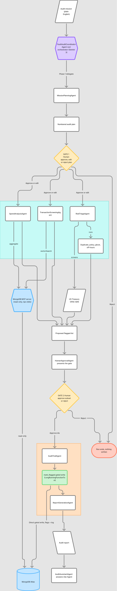
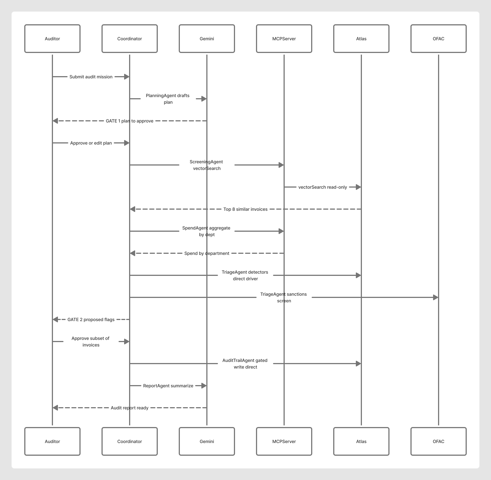

# FaultAuditAI

**An AI corporate-finance audit agent that hunts payment fraud — and keeps a human in control of every decision.**

[](https://faultauditai.flance.info/)
[](https://youtu.be/u69DFlnDZnA)
[](LICENSE)
[](https://rapid-agent.devpost.com/)

Built for the **Google Cloud Rapid Agent Hackathon** (MongoDB track). A multi-agent team on **Google Vertex AI Agent Builder (ADK) + Gemini 3**, with **MongoDB Atlas Vector Search** as its superpower, read through the official **MongoDB MCP server**.

> **Live:** https://faultauditai.flance.info/ · **Demo video:** https://youtu.be/u69DFlnDZnA · **Code:** https://github.com/proga100/fault-audit-ai

---

## The idea — and why it matters

Every month, finance and audit teams manually comb through hundreds of vendor payments hunting for duplicate invoices, ghost vendors, policy breaches, off-hours payments, and sanctioned payees. It's slow, error-prone, and exactly the repetitive, high-stakes work an agent should own — *as long as a human approves the consequential calls.*

FaultAuditAI takes a plain-English mission ("Audit this month's vendor payments"), **plans** the audit, **uses tools** to gather evidence across a live database and an external sanctions feed, **proposes** a flagged list with evidence, and **only writes anything after a human approves it.** It moves beyond chat: it manages a real MongoDB database, calls a live web service (US Treasury OFAC), and produces an artifact — an audit report plus an immutable audit log.

**Who it helps:** internal audit, AP, and finance-controls teams at any company processing vendor payments at volume — turning a multi-day manual review into a guided, evidence-backed mission with a human in the loop.

---

## Demo options

### Watch the 3-minute demo video

**▶ https://youtu.be/u69DFlnDZnA** — a guided walkthrough of a full audit mission: plan approval, live MCP-powered investigation, flagged findings, human approval, and the final report.

### 1. Hosted live demo (recommended)

The recommended way to evaluate FaultAuditAI is the hosted live demo:

**https://faultauditai.flance.info/**

It shows the full user experience: mission creation, AI audit planning, human approval gates, tool execution, flagged findings, final review, audit reporting, and audit logging.

### 2. Reproducible local demo (mock mode, no cloud credentials)

The repository also includes a local mock/demo mode so judges and reviewers can verify the project without cloud credentials. It is useful if the hosted demo is unavailable, cloud quotas are exhausted, external services are temporarily down, or you simply want to run the project from source.

```bash
docker build -t faultaudit .
docker run -p 8080:8080 faultaudit
# open http://localhost:8080
```

Mock mode demonstrates the same core workflow: mission planning, plan approval, streaming tool calls, flagged payment review, final approval, audit report, and audit log.

For the full live version, set `USE_MOCKS=false` and provide MongoDB Atlas and Google Cloud Vertex AI credentials (see [Quickstart](#quickstart)). Live mode uses Gemini, MongoDB Atlas Vector Search, and the official MongoDB MCP server.

---

## Why this fits the Google Cloud Rapid Agent Hackathon

FaultAuditAI was built as a **multi-step finance audit agent, not a simple chatbot.** It accepts a plain-English audit mission, creates an execution plan, asks for human approval, runs specialist audit tools, investigates transaction data, checks vendor and payment risks, generates an evidence-backed report, and records an audit trail.

It fits the hackathon because it demonstrates:

- **Agentic workflow** — the agent plans, executes, calls tools, collects evidence, ranks risks, and reports results.
- **Google Cloud / Gemini usage** — Gemini handles reasoning, planning, summarization, risk explanation, and report generation.
- **MongoDB MCP integration** — MongoDB MCP gives the agent a controlled, read-only way to inspect and query financial data.
- **MongoDB Atlas Vector Search** — similar or suspicious transactions are discovered by semantic similarity, not only exact matching.
- **Human-in-the-loop control** — the system asks for approval before executing the plan and before writing flagged findings.
- **Real-world finance impact** — it targets duplicate payments, suspicious vendors, unusual amounts, policy anomalies, and sanctions-related vendor risk.

The project shows how AI agents can support sensitive finance workflows while keeping the human responsible for final decisions.

---

## Architecture

<p align="center">
  <a href="docs/architecture.svg"></a>
</p>

A root **FaultAuditCoordinatorAgent** (Gemini 3 on Vertex AI) orchestrates a team of eight ADK agents through a multi-step mission. Two **structural human gates** interrupt the run — one to approve the plan, one to approve each flagged item — before anything is written. Reads flow through the read-only **MongoDB MCP server**; the single write deliberately bypasses MCP and is gated. *(Click the image to enlarge, or open the [interactive FigJam board](https://www.figma.com/board/SBry5WNkVe1PPJDyrOKNLJ/FaultAuditAI-Architecture).)*

---

## How it works — a multi-step mission with two human gates

```
Mission (plain English)
   │
   ▼
1. FaultAuditCoordinatorAgent → MissionPlanningAgent drafts a PLAN
   │
   ▼   ──────────────▶  GATE 1 (human): Approve / Edit / Reject the plan
   │
   ▼   (after approval, the coordinator delegates evidence-gathering)
2. TransactionScreeningAgent → MongoDB Atlas $vectorSearch   (via MCP)
3. SpendAnalysisAgent        → MongoDB aggregation by dept   (via MCP)
4. RiskTriageAgent           → duplicate / policy / ghost / off-hours detectors
5. RiskTriageAgent           → OFAC sanctions screen (live US Treasury SDN)
   │
   ▼
6. Proposed flagged list  ──▶  GATE 2 (human): Approve a subset / Reject each item
   │
   ▼   (only after approval)
7. AuditTrailAgent → gated write of flags + audit log to Atlas
8. ReportGenerationAgent → concise Gemini audit narrative + report
```

The approval gates are **structural, not prompt-based**: the write tool is an ADK `LongRunningFunctionTool` that *pauses the run* until a human decision arrives ([`faultaudit/agent/gates.py`](faultaudit/agent/gates.py)). The agent physically cannot write without you.

- **Gate 1 (plan):** approve, **edit the plan text**, or reject. Reject ends the run with nothing written.
- **Gate 2 (action):** approve a **subset** of proposed invoice IDs, or reject. Only approved IDs are written.

---

## The agent team

The live deployment runs the ADK multi-agent path (`/api/status` → `agent_runtime: adk_multi_agent`). All agents are `google.adk.agents.LlmAgent` instances reasoning with Gemini 3 on Vertex AI; the coordinator owns them as `sub_agents`. See [`faultaudit/agent/agent.py`](faultaudit/agent/agent.py) and [`faultaudit/agent/roster.py`](faultaudit/agent/roster.py).

| Agent | Role | Tools / data |
|---|---|---|
| **FaultAuditCoordinatorAgent** | Root orchestrator; enforces the two-gate workflow and delegates | Gemini 3 · Vertex AI |
| **MissionPlanningAgent** | Drafts the numbered audit plan before Gate 1 | Gemini 3 |
| **TransactionScreeningAgent** | Finds transactions semantically similar to known fraud | **MongoDB MCP** `$vectorSearch` |
| **SpendAnalysisAgent** | Aggregates spend by department / category | **MongoDB MCP** `aggregate` |
| **RiskTriageAgent** | Runs deterministic detectors + sanctions screen | duplicate · policy · ghost-vendor · off-hours · OFAC |
| **HumanApprovalAgent** | Explains each gate; never approves on the user's behalf | `LongRunningFunctionTool` |
| **AuditTrailAgent** | Performs the approved, gated write to the audit log | `mark_flagged` (gated write) |
| **ReportGenerationAgent** | Writes the closing finance-review narrative | Gemini 3 |
| **AuditAssistantAgent** | Answers scoped auditor questions ("Ask Agent") | Gemini 3 |

---

## Google Agent Builder (ADK) — what & where

FaultAuditAI is built on the **code-first path of Vertex AI Agent Builder** — the Google Agent Development Kit (`google.adk`):

- **`LlmAgent`** = Agent Builder agents reasoning with Gemini 3 on Vertex AI. The root coordinator composes the eight specialists via `sub_agents` ([`agent.py`](faultaudit/agent/agent.py)).
- **`LongRunningFunctionTool`** = the human-in-the-loop primitive. The `mark_flagged` write is wrapped in one so the runtime suspends until the FastAPI layer delivers the human's Gate-2 decision — this is what makes the gate *structural* rather than a polite prompt.
- **`FunctionTool` / `McpToolset`** expose the evidence tools (vector search, aggregation, detectors, OFAC) to the model with auto-generated calling schemas.
- **Deployable to Agent Engine:** a module-level `root_agent = build_agent_team()` follows ADK convention, so the same agent runs under `adk run` locally or deploys to Vertex AI **Agent Engine**.

---

## MongoDB MCP — the partner power (what, where, how)

MongoDB is not just the datastore — it's the agent's core investigative capability, accessed the right way through the **official MongoDB MCP server**.

**What.** All agent reads run through the official `mongodb-mcp-server`, launched **read-only** over stdio and filtered to a safe surface:

```python
# faultaudit/agent/agent.py  (build_mongodb_mcp)
McpToolset(
    connection_params=StdioConnectionParams(StdioServerParameters(
        command="npx",
        args=["-y", "mongodb-mcp-server", "--readOnly"],
        env={"MDB_MCP_CONNECTION_STRING": settings.atlas_uri},
    )),
    tool_filter=["find", "aggregate", "count", "collection-schema"],
)
```

**Where it's used.** The toolset is attached to exactly the two read specialists — `TransactionScreeningAgent` and `SpendAnalysisAgent`. At runtime, `$vectorSearch` and aggregation pipelines are executed through MCP via [`mcp_aggregate()`](faultaudit/agent/mcp_reads.py), which parses the server's `<untrusted-user-data>` security envelope and returns the documents ([`faultaudit/server/real_runner.py`](faultaudit/server/real_runner.py)).

**How the superpower works.** MongoDB Atlas stores transactions, vendors, and policies **together with their 768-dim `gemini-embedding-001` vectors** — no separate vector database. The agent embeds the mission text and runs Atlas **`$vectorSearch`** to surface invoices *semantically* similar to labeled fraud exemplars — catching reworded near-duplicates that a plain `GROUP BY` never finds.

**Read/write boundary (by design).** The MCP server is **read-only**. The one write — `mark_flagged`, which records flags and the audit log — deliberately **does not** go through MCP; it runs via the direct driver and only after Gate 2. Routing reads through a read-only MCP server and funneling the single write through a gated tool gives a least-privilege, auditable architecture by construction.

---

## Tech stack

Google Vertex AI Agent Builder (ADK / `google.adk`) · Gemini 3 (`gemini-3.1-pro-preview`) · `gemini-embedding-001` (768-dim) · MongoDB Atlas Vector Search · official MongoDB MCP server (read-only) · FastAPI + Server-Sent Events · Python 3.12 · vanilla-JS frontend · Docker.

---

## Quickstart

> For the fastest no-credentials demo, see [Demo options](#demo-options) above (`docker run`). This section covers local development and live mode.

### Run locally (mock mode)

```bash
python -m venv .venv && .venv/bin/pip install -r requirements.txt
.venv/bin/uvicorn faultaudit.server.app:app --reload --port 8080
```

### Run live (real Gemini + real Atlas vector search)

1. Create a MongoDB Atlas free cluster and a Google Cloud project with the Vertex AI API enabled.
2. Copy `.env.example` to `.env`, set `USE_MOCKS=false`, and fill in `ATLAS_URI` + `GCP_PROJECT` (defaults: `GEMINI_MODEL`, `EMBEDDING_MODEL=gemini-embedding-001`, `GOOGLE_GENAI_USE_VERTEXAI=TRUE`).
3. Provide Google credentials (a service-account key with the *Vertex AI User* role, or `gcloud auth application-default login`).
4. Load data and build the vector index:
   ```bash
   python demo_dataset/generate_data.py      # synthetic, GPL-3.0 corporate ledger
   python embed_and_load.py                  # embed with gemini-embedding-001 + load to Atlas
   python create_vector_index.py             # create the Atlas Vector Search index
   ```
5. Start the app and open it — missions now run on real Gemini + real `$vectorSearch` through the MongoDB MCP server.

#### Live mode in Docker

```bash
docker run -p 8080:8080 \
  -e USE_MOCKS=false \
  -e ATLAS_URI="mongodb+srv://..." \
  -e GCP_PROJECT="your-project" \
  -e GOOGLE_APPLICATION_CREDENTIALS=/run/key.json \
  -v /path/to/gcp-key.json:/run/key.json:ro \
  faultaudit
```

---

## How to use

1. **Open the console** (the [live demo](https://faultauditai.flance.info/) or your local instance).
2. **Start a mission** — pick one of the audit presets (Vendor Payments, Duplicates, OFAC, Ghost Vendors, …) or type your own in plain English, then press **Run Audit Mission**.
3. **Gate 1 — approve the plan.** Gemini proposes a numbered plan; approve it, edit the text, or reject.
4. **Watch the agents work.** The left pane streams each agent's tool calls live over SSE — vector search, aggregation, detectors, OFAC.
5. **Gate 2 — approve findings.** Review the proposed flagged list with per-item evidence; approve a subset or reject items. Only approved items are written.
6. **Read the report.** The agent writes the flags + audit log to Atlas and generates a finance-review narrative.
7. **Ask the agent.** Use "Ask Agent" for scoped follow-up questions grounded in the run's findings.

---

## API surface

FastAPI + SSE ([`faultaudit/server/app.py`](faultaudit/server/app.py)):

| Method | Endpoint | Purpose |
|---|---|---|
| `GET`  | `/healthz` | Health check |
| `GET`  | `/api/status` | Runtime mode, model, MCP status |
| `GET`  | `/api/stats` | Baseline dataset metrics |
| `POST` | `/api/mission` | Start a mission → `{ run_id }` |
| `GET`  | `/api/events/{run_id}` | **SSE** stream of agent events |
| `POST` | `/api/approve/{run_id}` | Deliver a Gate 1 / Gate 2 decision |
| `GET`  | `/api/report/{run_id}` | Fetch the final audit report |
| `POST` | `/api/ask` | Ask the audit assistant |

---

## Tests

```bash
.venv/bin/pip install -r requirements.txt
.venv/bin/python -m pytest          # 154 tests, all on mocks (no creds needed)
```

The suite (in-memory MongoDB via `mongomock`) covers the policy engine, exact + vector duplicate detection, OFAC matching, the gate state machine, the gated write, the ADK agent-team assembly, the FastAPI routes, the data loader, and an end-to-end audit.

---

## Execution sequence (true call order)

<p align="center">
  <a href="docs/sequence.svg"></a>
</p>

The time-ordered view of a live run: vector search and aggregation go through the **MongoDB MCP server** to Atlas, while the detectors and the gated write use the direct driver. The two human gates interrupt between planning and investigation, and again before the write.

---

## Judging criteria alignment

### Technological Implementation
A multi-step agent workflow built around Google Cloud, Gemini, MongoDB Atlas, and MongoDB MCP. The system does more than answer questions: it accepts an audit mission, creates an execution plan, waits for human approval, runs audit tools, screens transactions, checks vendor risk, identifies duplicate-like payments, generates an audit report, and records an audit trail. MongoDB MCP is the agent's evidence layer for database inspection, transaction search, aggregation, and Atlas Vector Search; Gemini / Google Cloud handles planning, reasoning, summarization, risk explanation, and report generation. The project also separates mock/demo mode from live mode, making it both easy to evaluate and practical to connect to real cloud services.

### Design
The user experience is designed around **trust, clarity, and control.** Finance and audit users should not have to trust a black-box AI system. FaultAuditAI shows what the agent plans to do, which tools are being used, what evidence was found, and which findings require approval:

```
User mission → AI audit plan → Human approval → Tool execution → Risk findings → Final human approval → Audit report
```

This keeps the product understandable for finance managers, auditors, and non-technical reviewers.

### Potential Impact
Payment fraud, duplicate vendor payments, suspicious invoices, and sanctions-related vendor risk are real problems for finance and internal-audit teams. FaultAuditAI can reduce manual review time, make payment audits more consistent, and give teams a repeatable, evidence-based workflow — especially valuable for small and mid-sized companies without large internal-audit departments or expensive enterprise fraud systems. The human-in-the-loop design also makes it appropriate for sensitive financial environments where AI should assist decisions, not replace accountability.

### Quality of the Idea
FaultAuditAI combines agentic AI with a practical corporate-finance audit workflow. The unique part is not only detecting suspicious payments — it turns financial audit into a controlled AI mission: the agent plans the work, investigates data, gathers evidence, explains risks, and asks for human approval before any consequential write or final report. MongoDB MCP and Atlas Vector Search make the database an **active investigation layer** instead of passive storage, creating a more useful agent workflow for real finance operations.

---

## Data & licensing

No public dataset is simultaneously corporate-grade, fraud-labeled, and commercially licensed, so FaultAuditAI ships a **synthetic** corporate ledger generated with [Faker](https://faker.readthedocs.io/) ([`demo_dataset/generate_data.py`](demo_dataset/generate_data.py)): ~1,500 invoices across 60 vendors with policies and budgets, plus injected fraud — 25 exact duplicates, 30 reworded near-duplicates, ghost vendors, policy violations, off-hours payments, and labeled fraud exemplars. Fully GPL-3.0 and reproducible from a fixed seed.

---

## Project structure

```
faultaudit/
  agent/      ADK agent team, gate state machine, MCP reads, audit pipeline, report, Gemini calls
  tools/      policy · dedup · ofac · mongo reads · gated write
  server/     FastAPI app, SSE events, real + ADK + fake runners
  web/        two-pane UI (mission timeline + dashboard) + standalone mock server
demo_dataset/ synthetic data generator
docs/         architecture + sequence diagrams
embed_and_load.py · create_vector_index.py · vector_index.json
```

---

## Links

- **Live demo:** https://faultauditai.flance.info/
- **Demo video:** https://youtu.be/u69DFlnDZnA
- **Repository:** https://github.com/proga100/fault-audit-ai
- **Hackathon:** [Google Cloud Rapid Agent Hackathon](https://rapid-agent.devpost.com/) — MongoDB track
- **License:** [GPL-3.0](LICENSE) © 2026 Rustamjon Akhmedov
